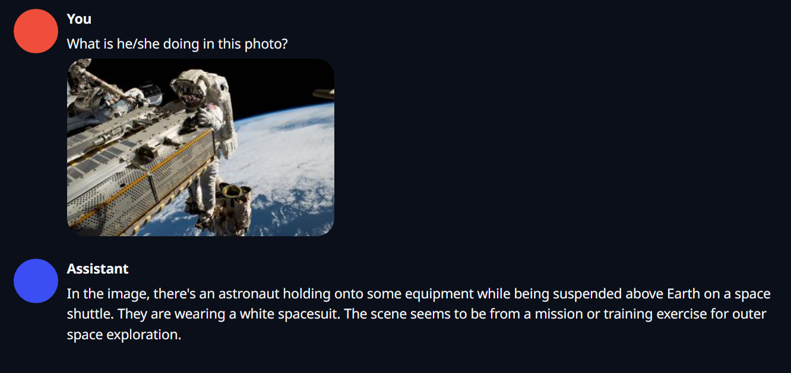

# jetson-examples

<div align="">
  
</dev>

[](https://discord.gg/5BQCkty7vN)

This repository provides examples for running AI models and applications on [NVIDIA Jetson devices](https://www.seeedstudio.com/reComputer-J4012-p-5586.html) with a single command.

This repo builds upon the work of the [jetson-containers](https://github.com/dusty-nv/jetson-containers), [ultralytics](https://github.com/ultralytics/ultralytics) and other excellent projects. 

## Features
- 🚀 **Easy Deployment:** Deploy state-of-the-art AI models on Jetson devices in one line.
- 🔄 **Versatile Examples:** Supports text generation, image generation, computer vision and so on.
- ⚡ **Optimized for Jetson:** Leverages Nvidia Jetson hardware for efficient performance.


## Install
To install the package, run:

```sh
pip3 install jetson-examples
```

> Notes: 
> - Check [here](./docs/install.md) for more installation methods 
> - To upgrade to the latest version, use:  `pip3 install jetson-examples --upgrade`.


## Quickstart
To run and chat with [LLaVA](https://www.jetson-ai-lab.com/tutorial_llava.html), execute:

```sh
reComputer run llava
```
<div align="center">
  
</div>

## Example list

Here are some examples that can be run:

| Example                                          | Type                     | Model/Data Size | Docker Image Size | Command                                 |
| ------------------------------------------------ | ------------------------ | --------------- | ---------- | --------------------------------------- |
| 🆕 [Ultralytics-yolo](/reComputer/scripts/ultralytics-yolo/README.md) | Computer Vision |  | 15.4GB  | `reComputer run  ultralytics-yolo`  |
| 🆕 [Deep-Live-Cam](/reComputer/scripts/deep-live-cam/README.md) | Face-swapping | 0.5GB | 20GB  | `reComputer run  deep-live-cam`  |
| 🆕 llama-factory | Finetune LLM |  | 13.5GB  | `reComputer run  llama-factory`  |
| 🆕 [ComfyUI](/reComputer/scripts/comfyui/README.md) |Computer Vision |  | 20GB  | `reComputer run comfyui`  |
| [Depth-Anything-V2](/reComputer/scripts/depth-anything-v2/README.md) |Computer Vision |  | 15GB  | `reComputer run depth-anything-v2`  |
| [Depth-Anything](/reComputer/scripts/depth-anything/README.md) |Computer Vision |  | 12.9GB  | `reComputer run  depth-anything`  |
| [Yolov10](/reComputer/scripts/yolov10/README.md)     | Computer Vision         | 7.2M               | 5.74 GB     | `reComputer run yolov10`                 |
| Llama3                                         | Text (LLM)               | 4.9GB           | 10.5GB     | `reComputer run llama3`                 |
| [Ollama](https://github.com/ollama/ollama)     | Inference Server         | *               | 10.5GB     | `reComputer run ollama`                 |
| LLaVA                                            | Text + Vision (VLM)      | 13GB            | 14.4GB     | `reComputer run llava`                  |
| Live LLaVA                                       | Text + Vision (VLM)      | 13GB            | 20.3GB     | `reComputer run live-llava`             |
| Stable-diffusion-webui                           | Image Generation         | 3.97G           | 7.3GB      | `reComputer run stable-diffusion-webui` |
| Nanoowl                                          | Vision Transformers(ViT) | 613MB           | 15.1GB     | `reComputer run nanoowl`                |
| [Nanodb](../reComputer/scripts/nanodb/readme.md) | Vector Database          | 76GB            | 7.0GB      | `reComputer run nanodb`                 |
| Whisper                                          | Audio                    | 1.5GB           | 6.0GB      | `reComputer run whisper`                |
| [Yolov8-rail-inspection](/reComputer/scripts/yolov8-rail-inspection/readme.md) | Computer Vision | 6M | 13.8GB  | `reComputer run yolov8-rail-inspection`  |
| [TensorFlow MoveNet Thunder](/reComputer/scripts/MoveNet-Thunder/readme.md) |Computer Vision |  | 7.7GB  | `reComputer run  MoveNet-Thunder`  |
| [Parler-TTS mini: expresso](/reComputer/scripts/parler-tts/readme.md) | Audio |  | 6.9GB  | `reComputer run  parler-tts`  |


> Note: You should have enough space to run example, like `LLaVA`, at least `27.4GB` totally

More Examples can be found [examples.md](./docs/examples.md)

## Calling Contributors Join Us!

### How to work with us? 

Want to add your own example? Check out the [development guide](./docs/develop.md).

We welcome contributions to improve jetson-examples! If you have an example you'd like to share, please submit a pull request. Thank you to all of our contributors! 🙏 

This open call is listed in our [Contributor Project](https://github.com/orgs/Seeed-Studio/projects/6/views/1?filterQuery=jetson&pane=issue&itemId=64891723). If this is your first time joining us, [click here](https://github.com/orgs/Seeed-Studio/projects/6/views/1?pane=issue&itemId=30957479) to learn how the project works. We follow the steps with: 


- Assignments: We offer a variety of assignments to enhance wiki content, each with a detailed description.
- Submission: Contributors can submit their content via a Pull Request after completing the assignments.
- Review: Maintainers will merge the submission and record the contributions.

**Contributors receive a $250 cash bonus as a token of appreciation.**

For any questions or further information, feel free to reach out via the GitHub issues page or contact edgeai@seeed.cc 


## TODO List

- [ ] detect host environment and install what we need
- [ ] all type jetson support checking list
- [ ] try jetpack 6.0
- [ ] check disk space enough or not before run
- [ ] allow to setting some configs, such as `BASE_PATH`
- [ ] support jetson-containers update
- [ ] better table to show example's difference


## License
This project is licensed under the MIT License. 

## Resources
- https://github.com/dusty-nv/jetson-containers
- https://www.jetson-ai-lab.com/
- https://www.ultralytics.com/

