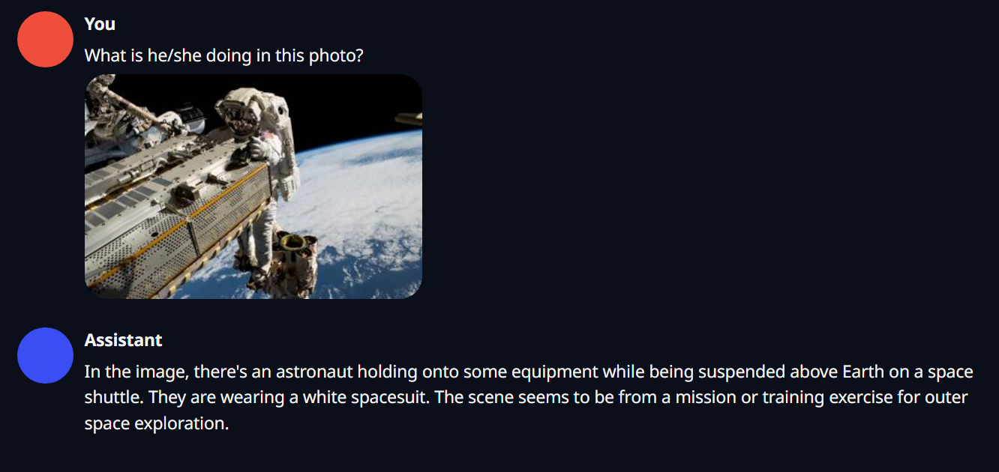

# jetson-examples

<div align="">
  
</dev>

[](https://discord.gg/5BQCkty7vN)

This repository provides examples for running AI models and applications on [NVIDIA Jetson devices](https://www.seeedstudio.com/reComputer-J4012-p-5586.html) with a single command.

This repo builds upon the work of the [jetson-containers](https://github.com/dusty-nv/jetson-containers), [ultralytics](https://github.com/ultralytics/ultralytics) and other excellent projects.

## Features
- 🚀 **Easy Deployment:** Deploy state-of-the-art AI models on Jetson devices in one line.
- 🔄 **Versatile Examples:** Supports text generation, image generation, computer vision and so on.
- ⚡ **Optimized for Jetson:** Leverages Nvidia Jetson hardware for efficient performance.


## Install
To install the package, run:

```sh
pip3 install jetson-examples
```

> Notes:
> - Check [here](./docs/install.md) for more installation methods
> - To upgrade to the latest version, use:  `pip3 install jetson-examples --upgrade`.


## Quickstart
To run and chat with [LLaVA](https://www.jetson-ai-lab.com/tutorial_llava.html), execute:

```sh
reComputer run llava
```
<div align="center">
  
</div>

## Example list

Here are some examples that can be run:

| Example                                          | Type                     | Model/Data Size | Docker Image Size | Command                                 | Supported JetPack |
| ------------------------------------------------ | ------------------------ | --------------- | ---------- | --------------------------------------- | ------------------------------------------------ |
| 🆕 [Ultralytics-yolo](/reComputer/scripts/ultralytics-yolo/README.md) | Computer Vision |  | 15.4GB  | `reComputer run  ultralytics-yolo`  | 4.6, 5.1.1, 5.1.2, 5.1.3, 6.0, 6.1, 6.2 |
| 🆕 [Deep-Live-Cam](/reComputer/scripts/deep-live-cam/README.md) | Face-swapping | 0.5GB | 20GB  | `reComputer run  deep-live-cam`  | 6.0 |
| 🆕 [Live-VLM-WebUI](/reComputer/scripts/live-vlm-webui/README.md) | Computer Vision (VLM) | * | * | `reComputer run live-vlm-webui` | 6.0, 6.1, 6.2, 6.2.1, 7.0, 7.1 |
| 🆕 llama-factory | Finetune LLM |  | 13.5GB  | `reComputer run  llama-factory`  | 5.1.1, 5.1.2, 5.1.3 |
| 🆕 [ComfyUI](/reComputer/scripts/comfyui/README.md) |Computer Vision |  | 20GB  | `reComputer run comfyui`  | 5.1.1, 5.1.2, 5.1.3 |
| [Depth-Anything-V2](/reComputer/scripts/depth-anything-v2/README.md) |Computer Vision |  | 15GB  | `reComputer run depth-anything-v2`  | 5.1.1, 5.1.2, 5.1.3 |
| [Depth-Anything-V3](/reComputer/scripts/depth-anything-v3/README.md) |Computer Vision |  | 7.6GB  | `reComputer run depth-anything-v3`  | 6.1, 6.2, 6.2.1 |
| 🆕 [Qwen3.5-4B](/reComputer/scripts/qwen3.5-4b/README.md) | Text (LLM) | 2.5GB | 0.2GB | `reComputer run qwen3.5-4b` | 6.1, 6.2, 6.2.1 |
| 🆕 [Qwen3.6-35B](/reComputer/scripts/qwen3.6-35b/README.md) | Text (LLM) | 28GB | 0.59GB | `reComputer run qwen3.6-35b` | 6.1, 6.2, 6.2.1 |
| 🆕 [Nemotron-3-Nano-30B](/reComputer/scripts/nemotron-3-nano/README.md) | Text (LLM) | 24.5GB | 0.59GB | `reComputer run nemotron-3-nano` | 6.1, 6.2, 6.2.1 |
| [Depth-Anything](/reComputer/scripts/depth-anything/README.md) |Computer Vision |  | 12.9GB  | `reComputer run  depth-anything`  | 5.1.1, 5.1.2, 5.1.3 |
| [Yolov10](/reComputer/scripts/yolov10/README.md)     | Computer Vision         | 7.2M               | 5.74 GB     | `reComputer run yolov10`                 | 5.1.1, 5.1.2, 5.1.3, 6.0 |
| Llama3                                         | Text (LLM)               | 4.9GB           | 10.5GB     | `reComputer run llama3`                 | 5.1.1, 5.1.2, 5.1.3, 6.0 |
| [gpt-oss](/reComputer/scripts/gpt-oss/README.md)     | Text (LLM)               | 39GB | 31.28GB    | `reComputer run gpt-oss`               | 6.1, 6.2, 6.2.1 |
| [ros1-jp6](/reComputer/scripts/ros1-jp6/README.md)   | Robotics / ROS 1         | *    | 1.27GB     | `reComputer run ros1-jp6`             | 6.1, 6.2, 6.2.1 |
| [nvblox](/reComputer/scripts/nvblox/README.md)       | Robotics / Mapping       | *    | 20.5GB+    | `reComputer run nvblox`                | 6.x |


> Note: You should have enough space to run example, like `LLaVA`, at least `27.4GB` totally

More Examples can be found [examples.md](./docs/examples.md)

## Calling Contributors Join Us!

### How to work with us?

Want to add your own example? Check out the [development guide](./docs/develop.md).

We welcome contributions to improve jetson-examples! If you have an example you'd like to share, please submit a pull request. Thank you to all of our contributors! 🙏

This open call is listed in our [Contributor Project](https://github.com/orgs/Seeed-Studio/projects/6/views/1?filterQuery=jetson&pane=issue&itemId=64891723). If this is your first time joining us, [click here](https://github.com/orgs/Seeed-Studio/projects/6/views/1?pane=issue&itemId=30957479) to learn how the project works. We follow the steps with:


- Assignments: We offer a variety of assignments to enhance wiki content, each with a detailed description.
- Submission: Contributors can submit their content via a Pull Request after completing the assignments.
- Review: Maintainers will merge the submission and record the contributions.

**Contributors receive a $250 cash bonus as a token of appreciation.**

For any questions or further information, feel free to reach out via the GitHub issues page or contact edgeai@seeed.cc


## TODO List

- [ ] detect host environment and install what we need
- [ ] all type jetson support checking list
- [ ] try jetpack 6.0
- [ ] check disk space enough or not before run
- [ ] allow to setting some configs, such as `BASE_PATH`
- [ ] support jetson-containers update
- [ ] better table to show example's difference

### 👥 Contributors

<p align="center"><a href="https://github.com/Seeed-Projects/jetson-examples/graphs/contributors">
  
</a></p>


## License
This project is licensed under the MIT License.

## Resources
- https://github.com/dusty-nv/jetson-containers
- https://www.jetson-ai-lab.com/
- https://www.ultralytics.com/
