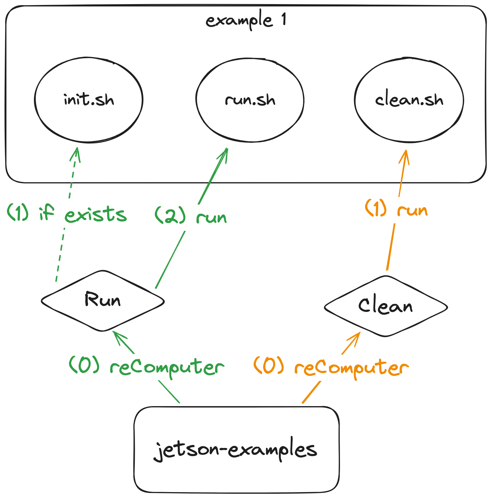
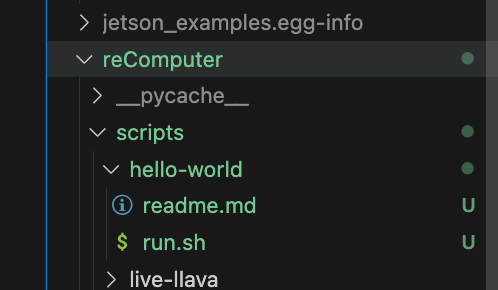

# Develop

This section provides guidance on how to contribute to the `jetson-examples` repository. It is highly recommended to develop and run your project on a Jetson device for the best experience.

## 0. Preparation

Follow these steps to get started:

```sh
# Clone the repository
git clone https://github.com/Seeed-Projects/jetson-examples.git

# Navigate to the repository
cd jetson-examples

# Install in 'develop mode'
pip install .

# Test the installed module
reComputer check

# If everything is okay, you should see the following output:
# Docker version...
# Python 3...
# ...
```

## 1. Project Structure

The project is structured as follows:

- `docs/`: This directory contains the project's documents.
  - `assets/`: This directory contains document assets, such as images.
- `reComputer/`: This is the main directory of the Python module.
  - `__init__.py`: This file is the initialization file for the Python module.
  - `main.py`: This file contains the main logic code for the Python module.
  - `scripts/`: This directory is used to store examples.
    - `xxxxx/`: This is an example directory. Everything inside this directory will be installed into the system. You can save files of any type, such as images, Python scripts, executable files, etc.
      - `init.sh`: **(optional)** This is the example init script. To initialize the project's initial data and environment.
      - `run.sh`: **(MOST IMPORTANT)** This is the example startup script. It is the only entry point for your project.
      - `readme.md`: **(optional)** This file provides an introduction to the example.
    - `check.sh`: This is the checking script **(Not Finished yet)**.
    - `run.sh`: This is the common startup script for examples.
- `install.sh`: This script uses `curl` and `github` to install `jetson-examples`.
- `pyproject.toml`: This file contains information on how to build and install `jetson-examples`.

## 2. Create Your Project



Follow these steps to create an `example` in this project:

```sh
# 1 Declare your project name as an environment variable
my_project=hello-world

# 2 Create a directory for your project
mkdir -p reComputer/scripts/$my_project

# 3 [required] Create the run.sh file
echo "echo 'hello world'" > reComputer/scripts/$my_project/run.sh

# 4 [option] Create the readme.md file
echo -e "# hello-world\n\n- Print \`hello-world\` to show how to add your project to this package" > reComputer/scripts/$my_project/readme.md

# 5 [option] Create the init.sh file
echo "echo 'init env'" > reComputer/scripts/$my_project/init.sh

# 6 [option] Create the clean.sh file
echo "echo 'clean data'" > reComputer/scripts/$my_project/clean.sh
```

After completing these steps, you should see the file changes as shown in the image below:



If you are familiar with creating and editing directories or files, you can use your preferred method.

## 3. Edit `$my_project/run.sh` to Customize Your Project

Use your preferred IDE (e.g., Vim, VS Code) to edit `reComputer/scripts/$my_project/run.sh` and add the desired functionality:

```sh
# Inside reComputer/scripts/$my_project/run.sh
echo 'hello world'
# TODO: Add code to achieve your desired functionality
# ...
```

## 4. Test Your Project

To test your project, follow these steps:

```sh
# Reinstall to make your new project work with `reComputer`
pip install .

# Run your new project with a one-line command
reComputer run hello-world
# INFO: Machine [Jetson AGX Orin] confirmed...
# Running example: hello-world
# ---- Example initialization ----
# jetson-ai-lab existed.
# ---- Example start ----
# hello world
# ---- Example done ----
```

## 5. (Optional) Add a `readme.md` File

If you want to provide additional information about your project, you can add a `readme.md` file. Use your preferred IDE to edit `reComputer/scripts/$my_project/readme.md`:

```sh
# hello-world
- Print hello-world to show how to add your project to this package
```

## 6. (Optional) Submit a New Pull Request

If you wish to contribute your project to the `jetson-examples` repository, you can follow these steps:

- 5.1 Fork this project.
- 5.2 Create a new branch in your project.
- 5.3 Commit the changes you made.
- 5.4 Push the changes to your project.
- 5.5 Create a pull request (`origin-git-repo/main <- your-git-repo/newbranch`) at [https://github.com/Seeed-Projects/jetson-examples/pulls](https://github.com/Seeed-Projects/jetson-examples/pulls).
- 5.6 Wait for a code review.
- 5.7 Once your code passes the review, it will be merged.
- 5.8 Thank you for your contribution!
