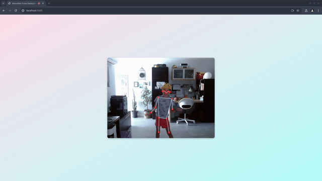

# MoveNet

MoveNet is a ultra fast and accurate pose detection model.

We're demonstrating here using reComputer J402



You can get more information on MoveNet from [TensorFlow](https://www.tensorflow.org/hub/tutorials/movenet)

## Getting started
#### Prerequisites
* SeeedStudio reComputer J402 [Buy one](https://www.seeedstudio.com/reComputer-J4012-p-5586.html)
* Webcam connected (one or the other)
  * to the reComputer
  * the computer you're using (remotely connected to the reComputer)
* Docker installed

## Instalation
PyPI (best)

```bash
pip install jetson-examples
```

## Usage
### Method 1
##### If you're running inside your reComputer
1. Type the following command in a terminal
```bash
reComputer run MoveNetJS
```
2. Open a web browser and go to [http://localhost:5000](http://localhost:5000)
3. Give permission to access webcam and wait a few seconds:
   1. First will appear the webcam feed
   2. Next will appear the lines estimating the pose
4. Start dancing

### Method 2
##### If you want to connect remotely with ssh to the reComputer
1. Connect using SSH but redirecting the 5000 port
```bash
ssh -L 5000:localhost:5000 <username>@<reComputer_IP>
```
2. Type the following command in a terminal
```bash
reComputer run movenetjs
```
2. Open a web browser (on your machine) and go to [http://localhost:5000](http://localhost:5000)
3. Give permission to access webcam and wait a few seconds:
   1. First will appear the webcam feed
   2. Next will appear the lines estimating the pose
4. Start dancing

**note** Firefox may fail showing webcam feed or pose estimation

