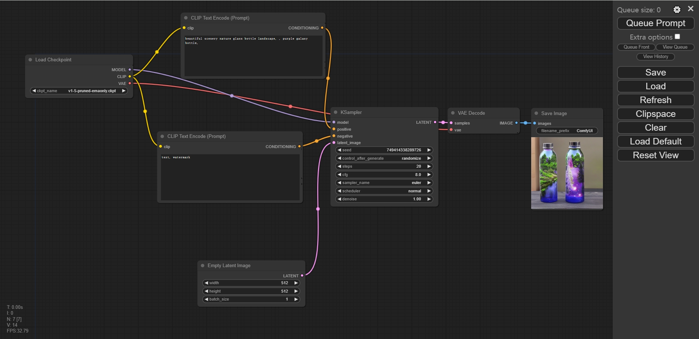

# Jetson-Example: Run ComfyUI (Stable Diffusion GUI) on NVIDIA Jetson Orin 🚀

## One-Click Quick Deployment of Plug-and-Play Stable Diffusion GUI
<p align="center">
  
</p>

## **Introduction** 📘
[ComfyUI](https://github.com/comfyanonymous/ComfyUI) will let you design and execute advanced stable diffusion pipelines using a graph/nodes/flowchart based interface. 
In this project, you can quickly deploy ComfyUI on Nvidia Jetson Orin devices with one click. 


## **Key Features**:
- **One-click installation and configuration support for Nvidia Jetson Orin devices.**
- **GPU acceleration to optimize the performance of stable diffusion pipelines.**
- Nodes/graph/flowchart interface to experiment and create complex Stable Diffusion workflows without needing to code anything.
- Fully supports SD1.x, SD2.x, [SDXL](https://comfyanonymous.github.io/ComfyUI_examples/sdxl/), [Stable Video Diffusion](https://comfyanonymous.github.io/ComfyUI_examples/video/), [Stable Cascade](https://comfyanonymous.github.io/ComfyUI_examples/stable_cascade/), [SD3](https://comfyanonymous.github.io/ComfyUI_examples/sd3/) and [Stable Audio](https://comfyanonymous.github.io/ComfyUI_examples/audio/)
- [Flux](https://comfyanonymous.github.io/ComfyUI_examples/flux/)
- Asynchronous Queue system
- Many optimizations: Only re-executes the parts of the workflow that changes between executions.
- Smart memory management: can automatically run models on GPUs with as low as 1GB vram.
- Works even if you don't have a GPU with: ```--cpu``` (slow)
- Can load ckpt, safetensors and diffusers models/checkpoints. Standalone VAEs and CLIP models.
- Embeddings/Textual inversion
- [Loras (regular, locon and loha)](https://comfyanonymous.github.io/ComfyUI_examples/lora/)
- [Hypernetworks](https://comfyanonymous.github.io/ComfyUI_examples/hypernetworks/)
- Loading full workflows (with seeds) from generated PNG, WebP and FLAC files.
- Saving/Loading workflows as Json files.
- Nodes interface can be used to create complex workflows like one for [Hires fix](https://comfyanonymous.github.io/ComfyUI_examples/2_pass_txt2img/) or much more advanced ones.
- [Area Composition](https://comfyanonymous.github.io/ComfyUI_examples/area_composition/)
- [Inpainting](https://comfyanonymous.github.io/ComfyUI_examples/inpaint/) with both regular and inpainting models.
- [ControlNet and T2I-Adapter](https://comfyanonymous.github.io/ComfyUI_examples/controlnet/)
- [Upscale Models (ESRGAN, ESRGAN variants, SwinIR, Swin2SR, etc...)](https://comfyanonymous.github.io/ComfyUI_examples/upscale_models/)
- [unCLIP Models](https://comfyanonymous.github.io/ComfyUI_examples/unclip/)
- [GLIGEN](https://comfyanonymous.github.io/ComfyUI_examples/gligen/)
- [Model Merging](https://comfyanonymous.github.io/ComfyUI_examples/model_merging/)
- [LCM models and Loras](https://comfyanonymous.github.io/ComfyUI_examples/lcm/)
- [SDXL Turbo](https://comfyanonymous.github.io/ComfyUI_examples/sdturbo/)
- [AuraFlow](https://comfyanonymous.github.io/ComfyUI_examples/aura_flow/)
- [HunyuanDiT](https://comfyanonymous.github.io/ComfyUI_examples/hunyuan_dit/)
- Latent previews with [TAESD](#how-to-show-high-quality-previews)
- Starts up very fast.
- Works fully offline: will never download anything.
- [Config file](extra_model_paths.yaml.example) to set the search paths for models.

Workflow examples can be found on the [Examples page](https://comfyanonymous.github.io/ComfyUI_examples/)


## **Shortcuts**

| Keybind                            | Explanation                                                                                                        |
|------------------------------------|--------------------------------------------------------------------------------------------------------------------|
| Ctrl + Enter                       | Queue up current graph for generation                                                                              |
| Ctrl + Shift + Enter               | Queue up current graph as first for generation                                                                     |
| Ctrl + Z/Ctrl + Y                  | Undo/Redo                                                                                                          |
| Ctrl + S                           | Save workflow                                                                                                      |
| Ctrl + O                           | Load workflow                                                                                                      |
| Ctrl + A                           | Select all nodes                                                                                                   |
| Alt + C                            | Collapse/uncollapse selected nodes                                                                                 |
| Ctrl + M                           | Mute/unmute selected nodes                                                                                         |
| Ctrl + B                           | Bypass selected nodes (acts like the node was removed from the graph and the wires reconnected through)            |
| Delete/Backspace                   | Delete selected nodes                                                                                              |
| Ctrl + Backspace                   | Delete the current graph                                                                                           |
| Space                              | Move the canvas around when held and moving the cursor                                                             |
| Ctrl/Shift + Click                 | Add clicked node to selection                                                                                      |
| Ctrl + C/Ctrl + V                  | Copy and paste selected nodes (without maintaining connections to outputs of unselected nodes)                     |
| Ctrl + C/Ctrl + Shift + V          | Copy and paste selected nodes (maintaining connections from outputs of unselected nodes to inputs of pasted nodes) |
| Shift + Drag                       | Move multiple selected nodes at the same time                                                                      |
| Ctrl + D                           | Load default graph                                                                                                 |
| Alt + `+`                          | Canvas Zoom in                                                                                                     |
| Alt + `-`                          | Canvas Zoom out                                                                                                    |
| Ctrl + Shift + LMB + Vertical drag | Canvas Zoom in/out                                                                                                 |
| Q                                  | Toggle visibility of the queue                                                                                     |
| H                                  | Toggle visibility of history                                                                                       |
| R                                  | Refresh graph                                                                                                      |
| Double-Click LMB                   | Open node quick search palette                |


### Get a Jetson Orin Device 🛒
| Device Model | Description | Link |
|--------------|-------------|------|
| Jetson Orin Nano Dev Kit, Orin Nano 8GB, 40TOPS | Developer kit for NVIDIA Jetson Orin Nano | [Buy Here](https://www.seeedstudio.com/NVIDIAr-Jetson-Orintm-Nano-Developer-Kit-p-5617.html) |
| reComputer J4012, powered by Orin NX 16GB, 100 TOPS | Embedded computer powered by Orin NX | [Buy Here](https://www.seeedstudio.com/reComputer-J4012-p-5586.html) |

## **Quickstart** ⚡

### Modify Docker Daemon Configuration (Optional)
To enhance the experience of quickly loading models in Docker, you need to add the following content to the `/etc/docker/daemon.json` file:

```json
{
  "default-runtime": "nvidia",
  "runtimes": {
    "nvidia": {
      "path": "nvidia-container-runtime",
      "runtimeArgs": []
    }
  },
  "storage-driver": "overlay2",
  "data-root": "/var/lib/docker",
  "log-driver": "json-file",
  "log-opts": {
    "max-size": "100m",
    "max-file": "3"
  },
  "no-new-privileges": true,
  "experimental": false
}
```

After modifying the `daemon.json` file, you need to restart the Docker service to apply the configuration:

```sh
sudo systemctl restart docker
```

### **Installation via PyPI (Recommended)** 🐍
1. Install the package:
    ```sh
    pip install jetson-examples
    ```

2. Restart your reComputer:
    ```sh
    sudo reboot
    ```

3. Run ComfyUI with one command:
    ```sh
    reComputer run comfyui
    ```
- **Input Dir**: Mount the input directory in Docker to the host directory `~/ComfyUI/input`.
- **Output Dir**: Mount the output directory in Docker to the host directory `~/ComfyUI/output`.

- **Models Dir**: Mount the models directory in Docker to the host directory `~/ComfyUI/models`.


## **For more tutorials** 🔧
- [ComfyUI Basic Tutorial VN](https://comfyanonymous.github.io/ComfyUI_tutorial_vn/)
- [ComfyUI](https://github.com/comfyanonymous/ComfyUI)
- [ComfyUI Examples](https://comfyanonymous.github.io/ComfyUI_examples/)
- [Comfy Org](https://www.comfy.org/)

## License

This project is licensed under the GNU General Public License v3.0
