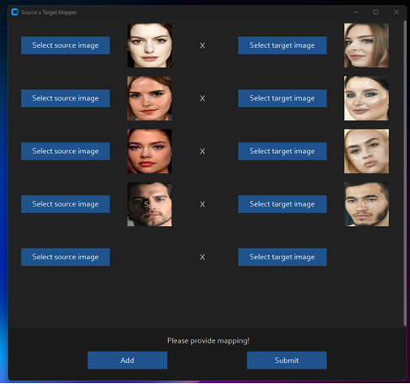

# Jetson-Example: Run Deep Live Cam on Seeed Studio NVIDIA AGX Orin Developer Kit 🚀

This project provides a one-click deployment of the Deep Live Cam AI face-swapping project on the [Seeed Studio Jetson AGX Orin Developer Kit](https://www.seeedstudio.com/NVIDIArJetson-AGX-Orintm-64GB-Developer-Kit-p-5641.html), retaining all the features of the [original project](https://github.com/hacksider/Deep-Live-Cam) and supporting functionalities such as image-to-image, image-to-video, and image-to-webcam.

<p align="center">
  
</p>

All models and inference engine implemented in this project are from the official [Deep-Live-Cam](https://github.com/hacksider/Deep-Live-Cam).

## Get a Jetson Orin Device 🛒
| Device Model  | Link |
|--------------|------|
| Jetson AGX Orin Dev Kit 32G | [Buy Here](https://www.seeedstudio.com/NVIDIA-Jetson-AGX-Orin-Developer-Kit-p-5314.html) |
| Jetson AGX Orin Dev Kit 64G | [Buy Here](https://www.seeedstudio.com/NVIDIArJetson-AGX-Orintm-64GB-Developer-Kit-p-5641.html) |

## New Features 🔥
### Resizable Preview Window

Dynamically improve the performance by using the --resizable parameter


### Face Mapping

Track faces and change it on the fly


source video


Tick this switch



Map the faces


And see the magic!

> The images in the "New Features" section are sourced from the [github community](https://github.com/hacksider/Deep-Live-Cam).

## 🥳Getting Started
### 📜Prerequisites
- AGX Orin Developer Kit [(🛒Buy Here)](https://www.seeedstudio.com/NVIDIArJetson-AGX-Orintm-64GB-Developer-Kit-p-5641.html)
- Jetpack 6.0
- USB Camera (optional)


### Modify Docker Daemon Configuration (Optional)
To enhance the experience of quickly loading models in Docker, you need to add the following content to the `/etc/docker/daemon.json` file:

```json
{
  "default-runtime": "nvidia",
  "runtimes": {
    "nvidia": {
      "path": "nvidia-container-runtime",
      "runtimeArgs": []
    }
  },
  "storage-driver": "overlay2",
  "data-root": "/var/lib/docker",
  "log-driver": "json-file",
  "log-opts": {
    "max-size": "100m",
    "max-file": "3"
  },
  "no-new-privileges": true,
  "experimental": false
}
```

After modifying the `daemon.json` file, you need to restart the Docker service to apply the configuration:

```sh
sudo systemctl restart docker
```


### 🚀Installation


PyPI(recommend)
  ```sh
  pip install jetson-examples
  ```
Linux (github trick)
```sh
curl -fsSL https://raw.githubusercontent.com/Seeed-Projects/jetson-examples/main/install.sh | sh
```
Github (for Developer)
```sh
git clone https://github.com/Seeed-Projects/jetson-examples
cd jetson-examples
pip install .
```

### 📋Usage
1. Run code:
    ```sh
    reComputer run deep-live-cam
    ```

2. An `image` folder will be created in the user's home directory, where templates and the face images or videos that need to be swapped can be placed.

3. Click `Select a face` to choose an image of a face.

4. Click the `Select a target` button to choose a target face image.

5. Click `Preview` to display the transformed result, and click `Start` to save the result to the specified directory without displaying it.

6. Click `Preview` to display the transformed result, and click `Start` to save the result to the specified directory without displaying it.

7. You can choose the `Face enhancer` to enhance facial details and features.

8. Click `Live` to open the webcam for real-time conversion. Please connect a USB camera before starting the program.

> ⚠️ **Note**: The first time you convert an image, it may take approximately two minutes.

## 🙏🏻Thanks
[Deep-Live-Cam](https://github.com/hacksider/Deep-Live-Cam)

## 💨Contributing

We welcome contributions from the community. Please fork the repository and create a pull request with your changes.


## 🙅‍Disclaimer
This software is meant to be a productive contribution to the rapidly growing AI-generated media industry. It will help artists with tasks such as animating a custom character or using the character as a model for clothing etc.

The developers of this software are aware of its possible unethical applications and are committed to take preventative measures against them. It has a built-in check which prevents the program from working on inappropriate media including but not limited to nudity, graphic content, sensitive material such as war footage etc. We will continue to develop this project in the positive direction while adhering to law and ethics. This project may be shut down or include watermarks on the output if requested by law.

Users of this software are expected to use this software responsibly while abiding by local laws. If the face of a real person is being used, users are required to get consent from the concerned person and clearly mention that it is a deepfake when posting content online. Developers of this software will not be responsible for actions of end-users.

## ✅License

This project is licensed under the AGPL-3.0 License.
