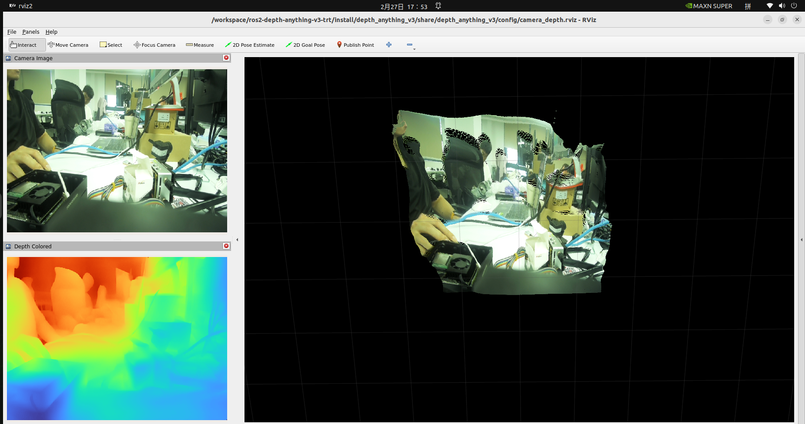

# Jetson-Example: Run Depth Anything V3 on NVIDIA Jetson

This project provides one-click deployment for **Depth Anything V3** on NVIDIA Jetson devices.
It uses the prebuilt Docker image:

```sh
chenduola6/depth-anything-v3:jp6.2
```

Image size: **7.6 GB**

Supported JetPack/L4T versions:
- JetPack 6.2 -> L4T 36.4.0
- JetPack 6.2.1 -> L4T 36.4.3
- JetPack 6.1 -> L4T 36.4.4

<p align="center">
  
</p>


## Getting Started

### Prerequisites
- NVIDIA Jetson device with a supported L4T version
- Docker installed and available
- USB camera (for camera inference)

### Installation

PyPI (recommended):
```sh
pip install jetson-examples
```

GitHub (developer):
```sh
git clone https://github.com/Seeed-Projects/jetson-examples
cd jetson-examples
pip install .
```

## Usage

1. Start the demo container with `reComputer`:
   ```sh
   reComputer run depth-anything-v3
   ```
   If your user is not in docker group yet, script will fallback to `sudo docker` automatically and ask sudo password once at startup.

2. Enter the running container:
   ```sh
   docker exec -it depth-anything-v3 /bin/bash
   ```
   If needed, use:
   ```sh
   sudo docker exec -it depth-anything-v3 /bin/bash
   ```

3. Run USB camera inference inside the container:
   ```sh
   cd workspace/ros2-depth-anything-v3-trt
   USB_SIMPLE=1 ./run_camera_depth.sh
   ```

## Cleanup

Only remove the container (keep image cache):
```sh
reComputer clean depth-anything-v3
```

## References
- [Depth Anything v3 project](https://github.com/ByteDance-Seed/Depth-Anything-3)
- [ros2-depth-anything-v3-trt](https://github.com/ika-rwth-aachen/ros2-depth-anything-v3-trt)
- [Seeed jetson-examples](https://github.com/Seeed-Projects/jetson-examples)
