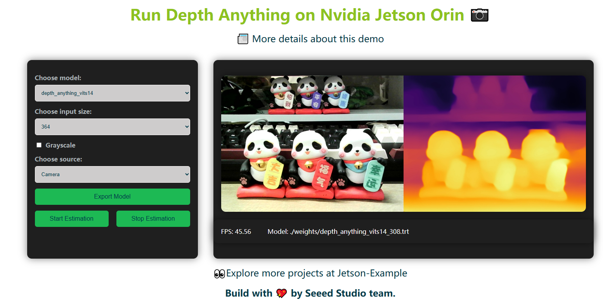
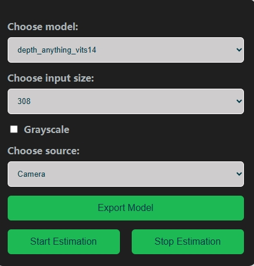

# Jetson-Example: Run Depth Anything on NVIDIA Jetson Orin 🚀
This project provides an one-click deployment of the Depth Anything monocular depth estimation model developed by Hong Kong University and ByteDance.  The deployment is visualized on [reComputer J4012](https://www.seeedstudio.com/reComputer-J4012-p-5586.html) (Jetson Orin NX 16GB, 100 TOPS) and includes a WebUI for model conversion to TensorRT and real-time depth estimation.
<p align="center">
  
</p>

All models and inference engine implemented in this project are from the official [Depth Anything](https://depth-anything.github.io/).

## 🔥Features

- One-click deployment for Depth Anything models.
- WebUI for model conversion and depth estimation.
- Support for uploading videos/images or using the local camera 
- Supports S, B, L models of Depth Anything with input sizes of 308, 384, 406, and 518.

    ### 🗝️WebUI Features
    - **Choose model**: Select from depth_anything_vits14 models. (S, B, L)
    - **Choose input size**: Select the desired input size.(308, 384, 406, 518)
    - **Grayscale option**: Option to use grayscale. 
    - **Choose source**: Select the input source (Video, Image, Camera).
    - **Export Model**: Automatically download and convert the model from PyTorch (.pth) to TensorRT format.
    - **Start Estimation**: Begin depth estimation using the selected model and input source.
    - **Stop Estimation**: Stop the ongoing depth estimation process.
    <p align="center">
      
    </p>

## 🥳Getting Started
### 📜Prerequisites
- reComputer J4012 [(🛒Buy Here)](https://www.seeedstudio.com/reComputer-J4012-p-5586.html)
- Docker installed on reComputer
- USB Camera (optional)


### Modify Docker Daemon Configuration (Optional)
To enhance the experience of quickly loading models in Docker, you need to add the following content to the `/etc/docker/daemon.json` file:

```json
{
  "default-runtime": "nvidia",
  "runtimes": {
    "nvidia": {
      "path": "nvidia-container-runtime",
      "runtimeArgs": []
    }
  },
  "storage-driver": "overlay2",
  "data-root": "/var/lib/docker",
  "log-driver": "json-file",
  "log-opts": {
    "max-size": "100m",
    "max-file": "3"
  },
  "no-new-privileges": true,
  "experimental": false
}
```

After modifying the `daemon.json` file, you need to restart the Docker service to apply the configuration:

```sh
sudo systemctl restart docker
```


### 🚀Installation


PyPI(recommend)
  ```sh
  pip install jetson-examples
  ```
Linux (github trick)
```sh
curl -fsSL https://raw.githubusercontent.com/Seeed-Projects/jetson-examples/main/install.sh | sh
```
Github (for Developer)
```sh
git clone https://github.com/Seeed-Projects/jetson-examples
cd jetson-examples
pip install .
```

### 📋Usage
1. Run code:
    ```sh
    reComputer run depth-anything
    ```
2. Open a web browser and input **http://{reComputer ip}:5000**. Use the WebUI to select the model, input size, and source.

3. Click on **Export Model** to download and convert the model.

4. Click on **Start Estimation** to begin the depth estimation process.

5. View the real-time depth estimation results on the WebUI.

## ⛏️Applications

- **Security**: Enhance surveillance systems with depth perception.
  <p align="center">
    
  </p>
- **Autonomous Driving**: Improve environmental sensing for autonomous vehicles.
  <p align="center">
    
  </p>
- **Underwater Scenes**: Apply depth estimation in underwater exploration.
  <p align="center">
      
    </p>
- **Indoor Scenes**: Use depth estimation for indoor navigation and analysis.
  <p align="center">
      
    </p>

## Further Development 🔧
- [Depth Anything Official](https://depth-anything.github.io/)
- [Depth Anything TensorRT](https://github.com/spacewalk01/depth-anything-tensorrt)
- [Depth Anything ONNX](https://github.com/fabio-sim/Depth-Anything-ONNX)
- [Depth Anything ROS](https://github.com/scepter914/DepthAnything-ROS)
- [Depth Anything Android](https://github.com/FeiGeChuanShu/ncnn-android-depth_anything)


## 🙏🏻Contributing

We welcome contributions from the community. Please fork the repository and create a pull request with your changes.

## ✅License

This project is licensed under the MIT License.

## 🏷️Acknowledgements

- Depth Anything [project](https://depth-anything.github.io/) by Hong Kong University and ByteDance.
- Seeed Studio team for their [support and resources](https://github.com/Seeed-Projects/jetson-examples).
