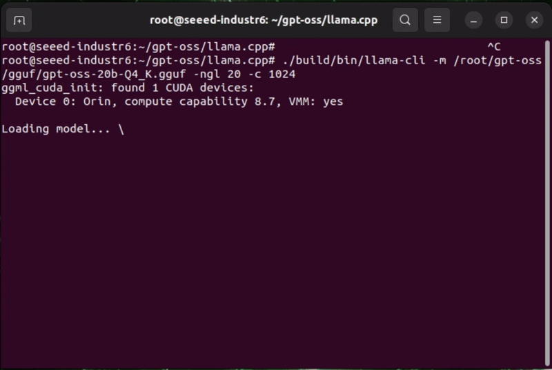

# Jetson-Example: Run GPT-OSS 20B on NVIDIA Jetson

This project provides one-click deployment for **GPT-OSS 20B** on NVIDIA Jetson devices.
It uses the prebuilt Docker image:

```sh
chenduola6/got-oss-20b:jp6.2
```

Docker image size: **31.28 GB**

## Hardware Requirements
- NVIDIA Jetson device with at least **16GB VRAM**
- At least **50GB** available disk space

Supported JetPack/L4T versions:
- JetPack 6.2 -> L4T 36.4.0
- JetPack 6.2.1 -> L4T 36.4.3
- JetPack 6.1 -> L4T 36.4.4

<p align="center">
  
</p>

## Getting Started

### Installation

PyPI (recommended):
```sh
pip install jetson-examples
```

GitHub (developer):
```sh
git clone https://github.com/Seeed-Projects/jetson-examples
cd jetson-examples
pip install .
```

## Usage

### One-line deployment
```sh
reComputer run gpt-oss
```

This command pulls the image and starts `llama-server` in a detached container.

> **Note**: If prompted by the script, allow adding your user to the `docker` group so future runs do not require `sudo docker`. After adding the group, log out and log back in once.
>
> **Note**: If startup fails because of memory pressure, add swap space and try again:
>
> ```sh
> sudo fallocate -l 16G /swapfile
> sudo chmod 600 /swapfile
> sudo mkswap /swapfile
> sudo swapon /swapfile
> ```

### Verify service
```sh
curl http://127.0.0.1:8080/v1/models
```

### Check logs
```sh
docker logs -f gpt-oss
```

## Manual Deployment (inside Docker)

```sh
docker pull chenduola6/got-oss-20b:jp6.2

docker run -it --rm \
  --gpus all \
  --network host \
  --ipc=host \
  chenduola6/got-oss-20b:jp6.2

# inside the container
cd /root/gpt-oss/llama.cpp

./build/bin/llama-server \
  -m /root/gpt-oss/gguf/gpt-oss-20b-Q4_K.gguf \
  -ngl 20 -c 1024 \
  --host 0.0.0.0 --port 8080
```

## Cleanup

Only remove the container (keep image cache):
```sh
reComputer clean gpt-oss
```

## References
- [llama.cpp](https://github.com/ggml-org/llama.cpp)
- [Seeed jetson-examples](https://github.com/Seeed-Projects/jetson-examples)
- [Setup step by step](https://wiki.seeedstudio.com/deploy_gptoss_on_jetson/)
