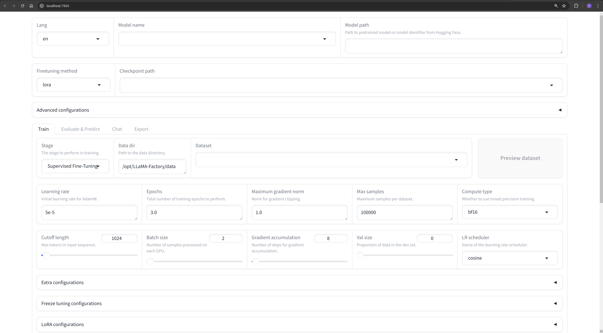
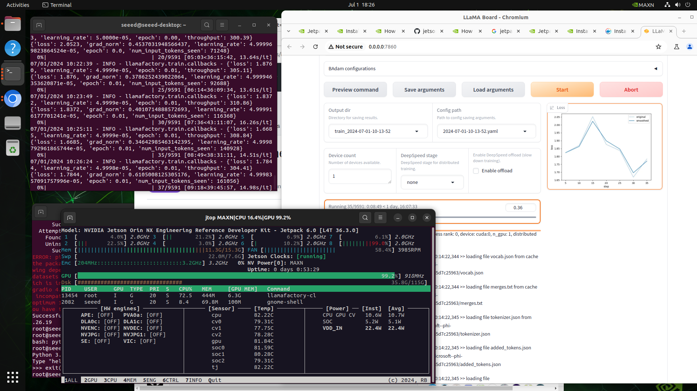

# Finetune LLM by Llama-Factory on Jetson


## Hello
Now you can tailor a custom private local LLM to meet your requirements.

💡 Here's an example of quickly deploying [Llama-Factory](https://github.com/hiyouga/LLaMA-Factory) on Jetson device.

🔥 Hightlights:
- **Llama-Factory** is an efficient tool to unify efficient Fine-Tuning of 100+ LLMs. 🚀🔍
- **Jetson-examples** is a toolkit designed to deploy containerized applications on NVIDIA Jetson devices. ✨
- **Jetson** is powerful AI hardware platform for edge computing.💻

🛠️ Follow the tutorial below to quickly experience the performance of Llama-Factory on edge computing devices.

<div align="center">
  
</div>

## Get a Jetson Orin Device 🛒
| Device Model | Description | Link |
|--------------|-------------|------|
| reComputer J4012, powered by Orin NX 16GB, 100 TOPS | Embedded computer powered by Orin NX | [Buy Here](https://www.seeedstudio.com/reComputer-J4012-p-5586.html) |
| NVIDIA® Jetson AGX Orin™ 64GB Developer Kit | Smallest and most powerful AI edge computer | [Buy Here](https://www.seeedstudio.com/NVIDIArJetson-AGX-Orintm-64GB-Developer-Kit-p-5641.html) |

## Getting Started

- install **jetson-examples** by pip:
    ```sh
    pip3 install jetson-examples
    ```
- restart reComputer 
    ```sh
    sudo restart
    ```
- run Llama-Factory webui on jetson in one line:
    ```sh
    reComputer run llama-factory
    ```
- Please visit http://127.0.0.1:7860

<div align="center">
  
</div>


## Run Training Script 

> **Note:** Some models and datasets require confirmation before using them, so we recommend logging in with your Hugging Face account by: 
> `sudo docker exec -it llama-factory huggingface-cli login`

There are a lot of parameters to choose from webui, you can refer to here for more information.

For demonstration purposes, set `Model name: Phi-1.5-1.3B`, `Dataset: alpaca_zh`, leave the other parameters unchanged, and then click the `Start` button

<div align="center">
  
</div>


## Build Docker Image
We highly recommend that you use `jetson-containers` to compile the docker container, as you can see [here](https://github.com/dusty-nv/jetson-containers/pull/566).

## Reference
- https://github.com/hiyouga/LLaMA-Factory
- https://github.com/dusty-nv/jetson-containers

