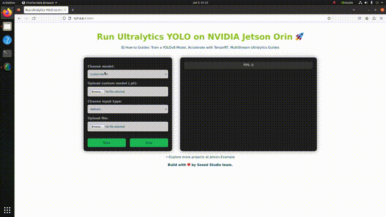
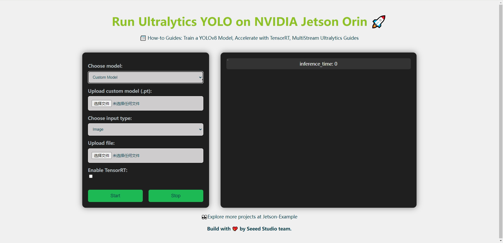
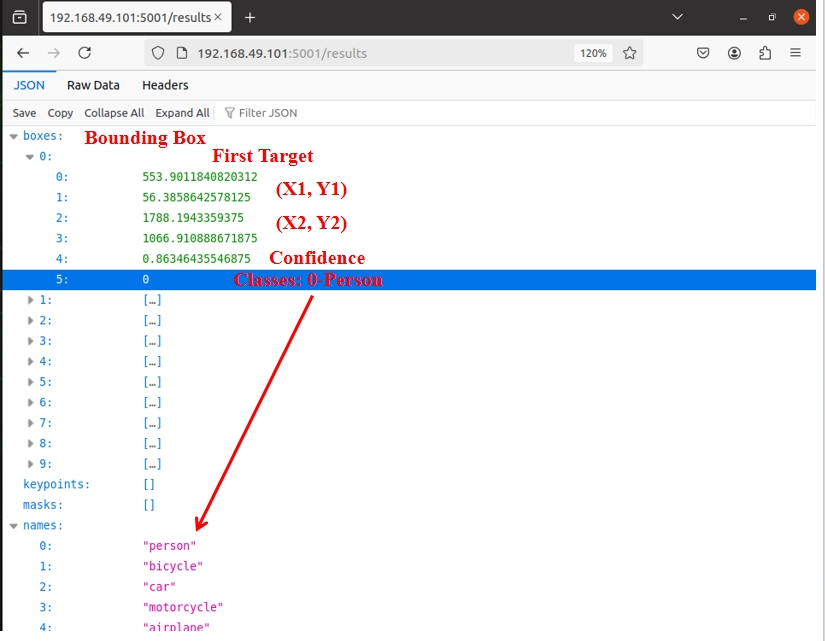

# Jetson-Example: Run Ultralytics YOLO Platform Service on NVIDIA Jetson Orin 🚀(**Supported YOLOV11**)

## One-Click Quick Deployment of Plug-and-Play All Ultralytics YOLO for All Task Models with Web UI and HTTP API Interface
<p align="center">
  
</p>

## Introduction 📘
In this project, you can quickly deploy all Ultralytics YOLO task models on Nvidia Jetson Orin devices with one click. This setup enables object detection, segmentation, human pose estimation, and classification. It supports uploading local videos, images, and using a webcam, and also allows one-click TensorRT model conversion. By accessing [http://127.0.0.1:5000](http://127.0.0.1:5000) on your local machine or within the same LAN, you can quickly start using Ultralytics YOLO. Additionally, an HTTP API method has been added at [http://127.0.0.1:5000/results](http://127.0.0.1:5000/results) to display detection data results for any task, and an additional Python script is provided to read YOLO detection data within Docker.

## **Key Features**:

1. **One-Click Deployment and Plug-and-Play**: Quickly deploy all YOLO task models on Nvidia Jetson Orin devices.
2. **Comprehensive Task Support**: Enables object detection, segmentation, human pose estimation, and classification.
3. **Versatile Input Options**: Supports uploading local videos, images, and using a webcam.
4. **TensorRT Model Conversion**: Allows one-click conversion of models to TensorRT.
5. **Web UI Access**: Easy access via [`http://127.0.0.1:5000`](http://127.0.0.1:5000) on the local machine or within the same LAN.
6. **HTTP API Interface**: Added HTTP API at [`http://127.0.0.1:5000/results`](http://127.0.0.1:5000/results) to display detection data results.
7. **Python Script Support**: Provides an additional Python script to read YOLO detection data within Docker.

[](https://github.com/ultralytics/ultralytics?tab=readme-ov-file#models)
All models implemented in this project are from the official [Ultralytics Yolo](https://github.com/ultralytics/ultralytics?tab=readme-ov-file#models).

# Supported Task Models

| Model Type  | Pre-trained Weights / Filenames                                                                                                     | Task                 | Inference | Validation | Training | Export |
|-------------|--------------------------------------------------------------------------------------------------------------------------------------|----------------------|-----------|------------|----------|--------|
| YOLOv5u     | yolov5nu, yolov5su, yolov5mu, yolov5lu, yolov5xu, yolov5n6u, yolov5s6u, yolov5m6u, yolov5l6u, yolov5x6u                              | Object Detection      | ✅        | ✅          | ✅        | ✅      |
| YOLOv8      | yolov8n.pt, yolov8s.pt, yolov8m.pt, yolov8l.pt, yolov8x.pt                                                                           | Detection            | ✅        | ✅          | ✅        | ✅      |
| YOLOv8-seg  | yolov8n-seg.pt, yolov8s-seg.pt, yolov8m-seg.pt, yolov8l-seg.pt, yolov8x-seg.pt                                                       | Instance Segmentation | ✅        | ✅          | ✅        | ✅      |
| YOLOv8-pose | yolov8n-pose.pt, yolov8s-pose.pt, yolov8m-pose.pt, yolov8l-pose.pt, yolov8x-pose-p6.pt                                               | Pose/Keypoints        | ✅        | ✅          | ✅        | ✅      |
| YOLOv8-obb  | yolov8n-obb.pt, yolov8s-obb.pt, yolov8m-obb.pt, yolov8l-obb.pt, yolov8x-obb.pt                                                       | Oriented Detection    | ✅        | ✅          | ✅        | ✅      |
| YOLOv8-cls  | yolov8n-cls.pt, yolov8s-cls.pt, yolov8m-cls.pt, yolov8l-cls.pt, yolov8x-cls.pt                                                       | Classification        | ✅        | ✅          | ✅        | ✅      |
| YOLOv11     | yolov11n.pt, yolov11s.pt, yolov11m.pt, yolov11l.pt, yolov11x.pt                                                                      | Detection            | ✅        | ✅          | ✅        | ✅      |
| YOLOv11-seg | yolov11n-seg.pt, yolov11s-seg.pt, yolov11m-seg.pt, yolov11l-seg.pt, yolov11x-seg.pt                                                  | Instance Segmentation | ✅        | ✅          | ✅        | ✅      |
| YOLOv11-pose| yolov11n-pose.pt, yolov11s-pose.pt, yolov11m-pose.pt, yolov11l-pose.pt, yolov11x-pose.pt                                              | Pose/Keypoints        | ✅        | ✅          | ✅        | ✅      |
| YOLOv11-obb | yolov11n-obb.pt, yolov11s-obb.pt, yolov11m-obb.pt, yolov11l-obb.pt, yolov11x-obb.pt                                                  | Oriented Detection    | ✅        | ✅          | ✅        | ✅      |
| YOLOv11-cls | yolov11n-cls.pt, yolov11s-cls.pt, yolov11m-cls.pt, yolov11l-cls.pt, yolov11x-cls.pt                                                  | Classification        | ✅        | ✅          | ✅        | ✅      |


### Get a Jetson Orin Device 🛒
| Device Model | Description | Link |
|--------------|-------------|------|
| Jetson Orin Nano Dev Kit, Orin Nano 8GB, 40TOPS | Developer kit for NVIDIA Jetson Orin Nano | [Buy Here](https://www.seeedstudio.com/NVIDIAr-Jetson-Orintm-Nano-Developer-Kit-p-5617.html) |
| reComputer J4012, powered by Orin NX 16GB, 100 TOPS | Embedded computer powered by Orin NX | [Buy Here](https://www.seeedstudio.com/reComputer-J4012-p-5586.html) |

## Quickstart ⚡

### Modify Docker Daemon Configuration (Optional)
To enhance the experience of quickly loading models in Docker, you need to add the following content to the `/etc/docker/daemon.json` file:

```json
{
  "default-runtime": "nvidia",
  "runtimes": {
    "nvidia": {
      "path": "nvidia-container-runtime",
      "runtimeArgs": []
    }
  },
  "storage-driver": "overlay2",
  "data-root": "/var/lib/docker",
  "log-driver": "json-file",
  "log-opts": {
    "max-size": "100m",
    "max-file": "3"
  },
  "no-new-privileges": true,
  "experimental": false
}
```

After modifying the `daemon.json` file, you need to restart the Docker service to apply the configuration:

```sh
sudo systemctl restart docker
```

### Installation via PyPI (Recommended) 🐍
1. Install the package:
    ```sh
    pip install jetson-examples
    ```

2. Restart your reComputer:
    ```sh
    sudo reboot
    ```

3. Run Ultralytics YOLO on Jetson with one command:
    ```sh
    reComputer run ultralytics-yolo
    ```
4. "Enter [`http://127.0.0.1:5001`](http://127.0.0.1:5001) or http://device_IP:5001 in your browser to access the Web UI."
    <p align="center">
      
    </p>

- **Choose Model**: Select Yolo version and models for various tasks such as object detection, classification, segmentation, human pose estimation, OBB, etc.
- **Upload Custom Model**: Users can upload their own trained YOLO models.
- **Choose Input Type**: Users can select to input locally uploaded images, videos, or real-time camera devices.
- **Enable TensorRT**: Choose whether to convert and use the TensorRT model. The initial conversion may require varying amounts of time.

5. If you want to see the detection result data, you can enter [`http://127.0.0.1:5000/results`](http://127.0.0.1:5000/results) in your browser to view the `JSON` formatted data results. These results include `boxes` for object detection, `masks` for segmentation, `keypoints` for human pose estimation, and the `names` corresponding to all numerical categories.
    <p align="center">
      
    </p>
    We also provide a Python script to help users integrate the data into their own programs.

    ```python
    import requests

    def fetch_results():
        response = requests.get('http://localhost:5001/results')
        if response.status_code == 200:
            results = response.json()
            return results
        else:
            print('Failed to fetch results')
            return None

    results = fetch_results()
    print(results)
    ```


## Notes 📝
- To stop detection at any time, press the Stop button.
- When accessing the WebUI from other devices within the same LAN, use the URL: `http://{Jetson_IP}:5000`.
- You can view the JSON formatted detection results by accessing http://{Jetson_IP}:5000/results.
- The first model conversion may require different amounts of time depending on the hardware and network environment, so please be patient.


## Further Development 🔧
- [Training a YOLO Model](https://wiki.seeedstudio.com/How_to_Train_and_Deploy_YOLOv8_on_reComputer/)
- [TensorRT Acceleration](https://wiki.seeedstudio.com/YOLOv8-DeepStream-TRT-Jetson/)
- [Multistreams using Deepstream](https://wiki.seeedstudio.com/YOLOv8-DeepStream-TRT-Jetson/#multistream-model-benchmarks) Tutorials.

## License

This project is licensed under the MIT License.
