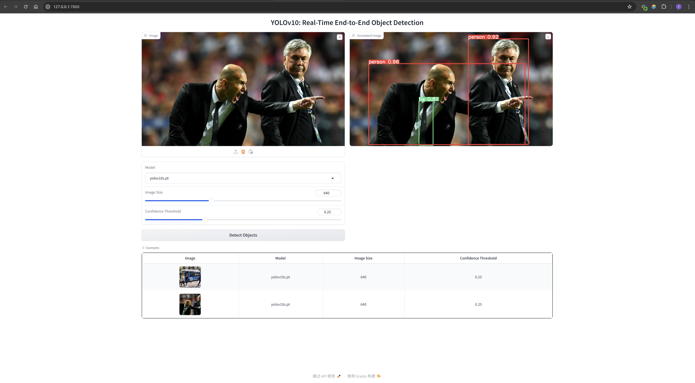

# Quickly Experience YOLOv10 on Jetson


## Hello

💡 Here's an example of quickly deploying YOLOv10 on a Jetson device.

🔥 Hightlights:
- **Yolov10** is a state-of-the-art real-time object detection model. 🚀🔍
- **Jetson-examples** is a toolkit designed to deploy containerized applications on NVIDIA Jetson devices. ✨
- **Jetson** is powerful AI hardware platform for edge computing.💻

🛠️ Follow the tutorial below to quickly experience the performance of YOLOv10 on edge computing devices.

<div align="center">
  
</div>

## Get a Jetson Orin Device 🛒
| Device Model | Description | Link |
|--------------|-------------|------|
| Jetson Orin Nano Dev Kit, Orin Nano 8GB, 40TOPS | Developer kit for NVIDIA Jetson Orin Nano | [Buy Here](https://www.seeedstudio.com/NVIDIAr-Jetson-Orintm-Nano-Developer-Kit-p-5617.html) |
| reComputer J4012, powered by Orin NX 16GB, 100 TOPS | Embedded computer powered by Orin NX | [Buy Here](https://www.seeedstudio.com/reComputer-J4012-p-5586.html) |


## Getting Started

- install **jetson-examples** by pip:
    ```sh
    pip3 install jetson-examples
    ```
- restart reComputer 
    ```sh
    sudo restart
    ```
- run yolov10 on jetson in one line:
    ```sh
    reComputer run yolov10
    ```
- Please visit http://127.0.0.1:7860

## Change Model

This example will automatically download the YOLOv10s model at startup. If you want to try different models, please use the following command to download the model and then select the appropriate model through the WebUI.


> **Note:** You can also download the model via a browser and copy the model to `/home/$USER/reComputer/yolov10/weights`.

| Model | Download Command |
| :------------: | :----------------------: |
| [YOLOv10-N](https://github.com/THU-MIG/yolov10/releases/download/v1.1/yolov10n.pt) |   `sudo wget -P /home/$USER/reComputer/yolov10/weights https://github.com/THU-MIG/yolov10/releases/download/v1.1/yolov10n.pt`  |
| [YOLOv10-S](https://github.com/THU-MIG/yolov10/releases/download/v1.1/yolov10s.pt) |   `sudo wget -P /home/$USER/reComputer/yolov10/weights https://github.com/THU-MIG/yolov10/releases/download/v1.1/yolov10s.pt`  |
| [YOLOv10-M](https://github.com/THU-MIG/yolov10/releases/download/v1.1/yolov10m.pt) |   `sudo wget -P /home/$USER/reComputer/yolov10/weights https://github.com/THU-MIG/yolov10/releases/download/v1.1/yolov10m.pt`  |
| [YOLOv10-B](https://github.com/THU-MIG/yolov10/releases/download/v1.1/yolov10b.pt) |   `sudo wget -P /home/$USER/reComputer/yolov10/weights https://github.com/THU-MIG/yolov10/releases/download/v1.1/yolov10b.pt`  |
| [YOLOv10-L](https://github.com/THU-MIG/yolov10/releases/download/v1.1/yolov10l.pt) |   `sudo wget -P /home/$USER/reComputer/yolov10/weights https://github.com/THU-MIG/yolov10/releases/download/v1.1/yolov10l.pt`  |
| [YOLOv10-X](https://github.com/THU-MIG/yolov10/releases/download/v1.1/yolov10x.pt) |   `sudo wget -P /home/$USER/reComputer/yolov10/weights https://github.com/THU-MIG/yolov10/releases/download/v1.1/yolov10x.pt`  | 


## Build Docker Image
Our provided container is built based on the `jetson-container`. This example provide a Dockerfile, allowing you to build a more suitable container according to your needs.

```sh
sudo docker build -t yolov10-jetson .
```

> **Note:**  Additionally, you can train models, test models, and export models within the Docker container environment. For detailed information, please refer to `THU-MIG/yolov10`.

## Reference
- https://github.com/THU-MIG/yolov10
- https://github.com/dusty-nv/jetson-containers

